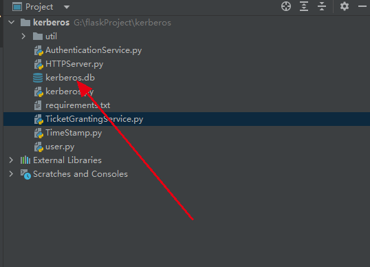
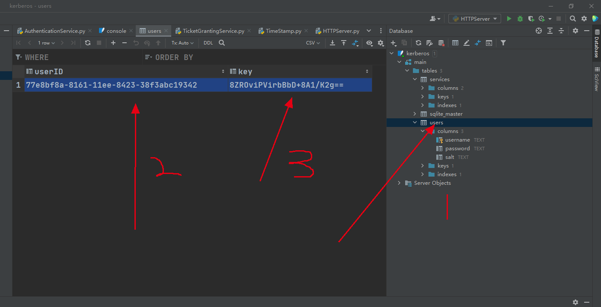
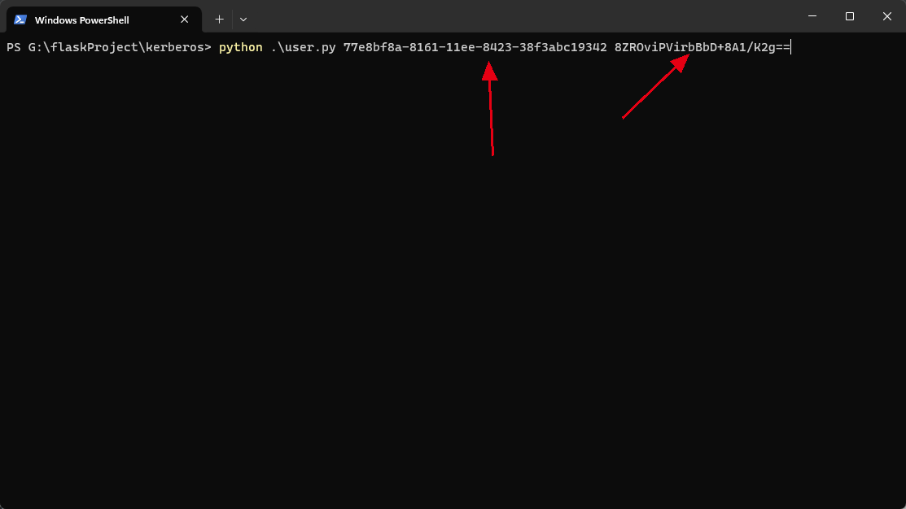
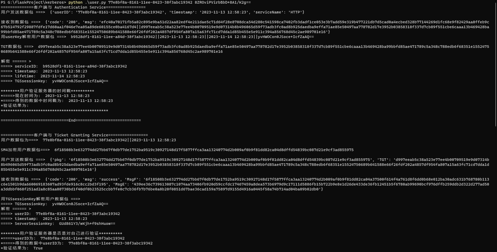

# Kerberos - simple to implement

## Directory structure

```
│  AuthenticationService.py
│  HTTPServer.py
│  kerberos.db
│  kerberos.py
│  requirements.txt
│  TicketGrantingService.py
│  TimeStamp.py
│  user.py
└─util
    │  APIResponse.py
    │  sm4Util.py
```


## Install

```
pip install -i https://pypi.tuna.tsinghua.edu.cn/simple -r requirements.txt
```


## Run

To run the following three files separately in the terminals：` TicketGrantingService.py` `HTTPServer.py` `AuthenticationService.py`


## Usage

### View the user information

Check the corresponding `userID` and `key` in the database (you can't see them directly in the Community Edition)






## Request verification

```shell
python .\user.py [userID] [key]
```



You can see the complete authentication process on the **user side**:

